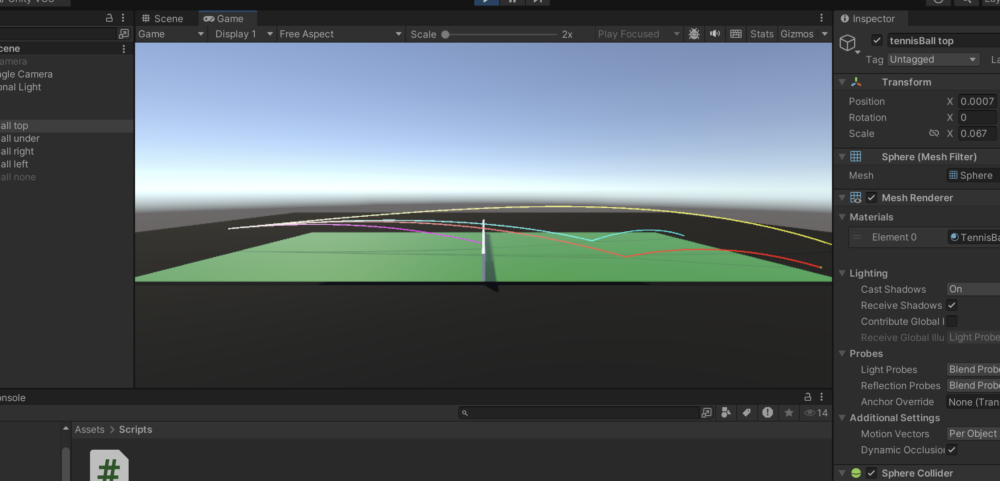

# ModSimProjekt
# 🎾 Tennis Ball Simulation – Physics-Based Modeling in Unity

A Unity simulation of a tennis ball trajectory including aerodynamics, spin, and bounce physics.

## 🧠 Features
- Magnus effect (spin-induced lift)
- Air resistance (drag force)
- Realistic bounce model (friction + restitution)
- Adjustable spin: topspin, backspin, sidespin
- Simulation until second bounce

## ⚙️ Tech
- Unity (C#)
- Physics modeling (custom forces, no built-in gravity)

## 📊 What we did
- Implemented physical model for ball motion
- Modeled bounce dynamics using friction & restitution
- Added spin system with Magnus force
- Simulated realistic trajectories

## 🎥 Demo

## 📌 Future improvements
- Net interaction
- Spin decay
- More accurate collision model